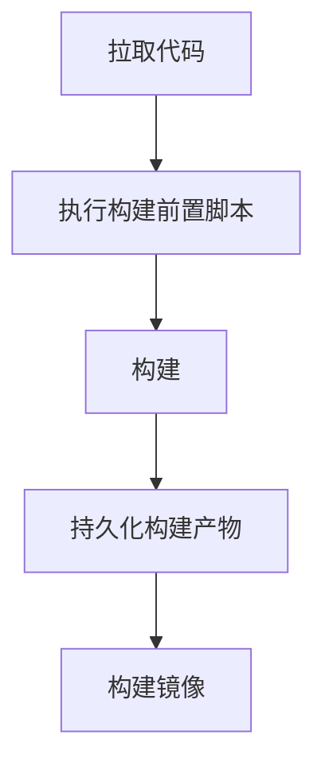

# 目录
[toc]

# 项目构建

> 该文档会随着系统的更新完善同步更新

## 1.注意事项

* 项目名称在一个命名空间下是唯一的，请勿重复使用；项目构建过程中会拉取远程仓库的代码，项目名称将作为拉取目标文件夹名称
* 需要关联其他项目？
  * 关联的项目在构建完毕后将会自动触发被关联的项目的自动构建
  * 你需要确保被关联的项目开启了自动构建，否则将会忽略
  * 被关联的项目在触发构建时会获取父项目的最后一次构建的持久化文件ID，该ID以环境变量的形式存在，具体说明请参考**环境变量**说明

## 2.安全说明

* Git源码仓库

  >  Git采用RSA&SSH的方式获取项目源码，过程中**不会泄露**用户密码等数据
* SVN源码仓库

  > SVN目前只支持明文密码传输，过程中**可能会泄露**用户名密码等数据

## 3.构建命令&构建参数

项目预设有常用的构建命令如下所示：

| 构建工具 | 命令              |
| -------- | ----------------- |
| Maven    | mvn clean package |
| Npm      | npm run build     |
| Yarn     | yarn run build    |

你可以在构建中加入自定义的构建参数，例如需要跳过单元测试可以添加如下参数

```sh
-DskipTests=true
```


## 4.持久化

开启持久化需要用户指定具体需要持久化哪些内容，具体设置如下：

* 需要指定构建产物路径，例如/target、/dist等
* 需要指定具体哪些文件，如果目录下所有文件都需要持久化，则填写通配符*

## 5.自定义脚本使用

在一个构建任务中允许在构建前后执行相应的shell脚本来处理文件或者触发某个远程Api，脚本将会被放入执行步骤中，并会被执行，执行步骤如下：



执行脚本示例，示例中涉及到部分全局变量，请阅读文末变量说明；具体脚本请根据实际情况编写

```sh
# 获取远程文件，并将文件添加至源码目录
if [ "$PARENT_PROJECT_LAST_BUILD_FILE" ]; then
 echo "获取到文件ID"
 wget http://"$REMOTE_SERVER"/api/v1/build/file/download/"$PARENT_PROJECT_LAST_BUILD_FILE"
 echo "解压文件"
 tar -zxvf "$PARENT_PROJECT_LAST_BUILD_FILE"
 mkdir -p "$BUILD_CODE_PATH"/"$PROJECT_NAME"/src/main/resources
 cp "XXX文件" "$BUILD_CODE_PATH"/"$PROJECT_NAME"/src/main/resources
else
 echo "文件ID不存在，处理失败"
 exit 1
fi
```

注意事项：

* 如果脚本执行逻辑中出现异常需要退出，请添加```exit 1```信号，如果使用```exit 0```则识别为正常退出脚本
* 编写脚本请避开耗时过长的命令，整个构建任务将会控制在30分钟内，超出则整个任务执行失败

## 6.构建全局变量说明
| 变量名  | 变量说明 | 注意事项 |
| ------------- | ------------- | ------------- |
| $BUILD_CODE_PATH | 构建工作目录 | 默认为容器下的/code文件夹 |
| $PROJECT_NAME | 远程仓库Clone目标名称 | |
| $BUILD_TARGET_PATH | 构建产物路径 | 例如webpack项目的/dist，maven项目的/target |
| $BUILD_TARGET_NAME | 构建产物名称                       | 可使用通配符*                                                |
| $REMOTE_SERVER                  | CAAS集群服务根URL | URL包含CAAS平台集群下的任意一台机器的IP+端口，可通过URL配置相应API路径访问开放资源 |
| $PARENT_PROJECT_LAST_BUILD_FILE | 父项目最后一次构建的构建产物文件ID |  |
| $FILE_ID | 当前构建的构建产物文件ID | 当打开持久化储存时，该ID生效 |

## 7.Dockerfile
### 指令说明
 * FROM：定制的镜像都是基于 FROM 的镜像
   > 如果需要使用Nginx镜像则 FROM nginx:latest，nginx镜像将作为你运行的基础
 * RUN：用于执行后面跟着的命令行命令
   > RUN 等同于执行Shell命令，在docker build过程中执行
 * ENV：设置环境变量
 * ARG：构建参数，与 ENV 作用一至
   > 作用域不一样。ARG 设置的环境变量仅对 Dockerfile 内有效，也就是说只有 docker build 的过程中有效，构建好的镜像内不存在此环境变量。 构建命令 docker build 中可以用 --build-arg <参数名>=<值> 来覆盖。
 * VOLUME：定义匿名数据卷
   > 在启动容器时忘记挂载数据卷，会自动挂载到匿名卷

   作用
   * 避免重要的数据，因容器重启而丢失，这是非常致命的。
   * 避免容器不断变大。

 * EXPOSE：声明端口
 * WORKDIR：工作目录
   > 用 WORKDIR 指定的工作目录，会在构建镜像的每一层中都存在。（WORKDIR 指定的工作目录，必须是提前创建好的）。
 * COPY：复制文件命令
   > 从上下文目录复制文件到镜像中，注意上下文目录指的是项目根目录
 * CMD：类似于 RUN 指令，用于运行程序
   > 运行命令行，区别于RUN，CMD会在docker run 过程中执行
 * ENTRYPOINT：类似于 CMD 指令
   > 但其不会被 docker run 的命令行参数指定的指令所覆盖，而且这些命令行参数会被当作参数送给 ENTRYPOINT 指令指定的程序。如果运行 docker run 时使用了 --entrypoint 选项，将覆盖 CMD 指令指定的程序。
### 示例
```dockerfile
FROM centos
RUN yum install wget
RUN wget -O redis.tar.gz "http://download.redis.io/releases/redis-5.0.3.tar.gz"
RUN tar -xvf redis.tar.gz
FROM centos
RUN yum install wget \
    && wget -O redis.tar.gz "http://download.redis.io/releases/redis-5.0.3.tar.gz" \
    && tar -xvf redis.tar.gz
```
